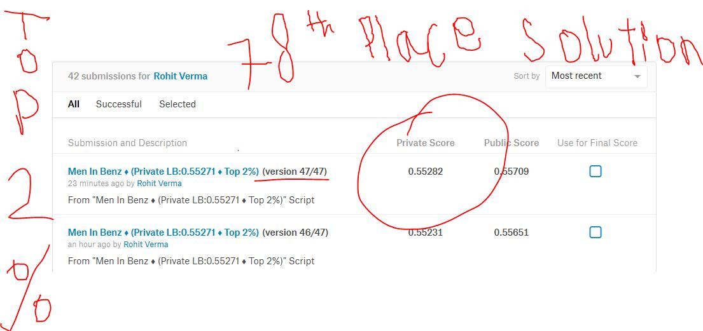

# Mercedes-Benz-Challenge-78th-Place-Solution-Private-LB-0.55282-Top-2-Percent-

In this competition, Daimler is challenging Kagglers to tackle the curse of dimensionality and reduce the time that cars spend on the test bench. Competitors will work with a dataset representing different permutations of Mercedes-Benz car features to predict the time it takes to pass testing. Winning algorithms will contribute to speedier testing, resulting in lower carbon dioxide emissions without reducing Daimler’s standards.

I have used various methods and techniques to reach this place on the private leaderboard. Actually, most of it is an art. Considerable feature engineering, transformations, redundancy, duplicate features, feature count of 378, so less rows that model could overfit easily ,inconsistent categories in training and test set and many more.....This dataset was something real to work on. And more than that anonymous features to engineer, that was a whole lot different thing to come across. Still after making around 64 different versions of my script I was able to come to top 2%.
